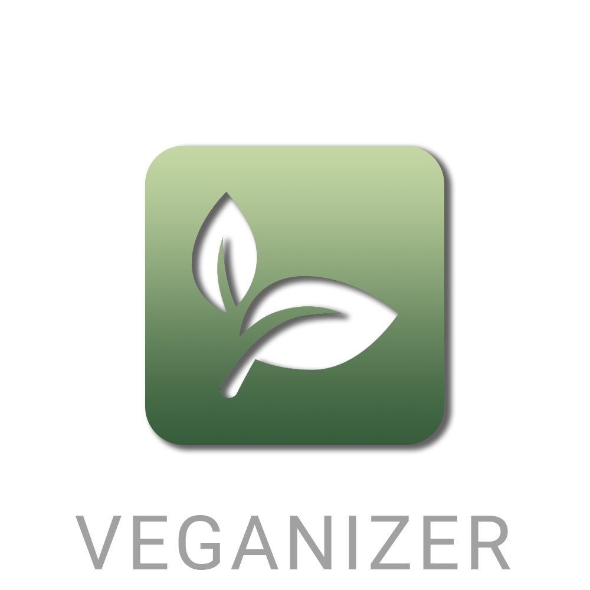

# Veganizer Project

This repository contains the Veganizer Project, a Flutter app that identifies meals from photos and suggests vegan recipes. The app utilizes a Flask API and a machine learning model based on VGG19 to classify the meals. Currently, it can distinguish between three dishes.

## Project Description

The Veganizer Project is designed to promote veganism by making it easier to find vegan recipes for common meals. Users can take a photo of their meal, and the app will identify the dish and provide a vegan recipe alternative.

## Features

- **Meal Recognition**: Uses VGG19 model to identify meals from photos.
- **Vegan Recipe Suggestions**: Offers vegan recipes based on the identified meal.
- **Flutter Frontend**: Provides a user-friendly interface for taking photos and viewing results.
- **Flask Backend**: Handles image processing and model inference.

## Data Sources

The machine learning model is trained using a dataset of labeled images. The vegan recipes are sourced from various online databases and curated to ensure quality and taste.

## Contributions

Contributions are welcome! Feel free to open an issue or submit a pull request if you have any suggestions or improvements.

## Acknowledgements

Special thanks to the contributors and the open-source community for their valuable resources and support in making this project a reality.
